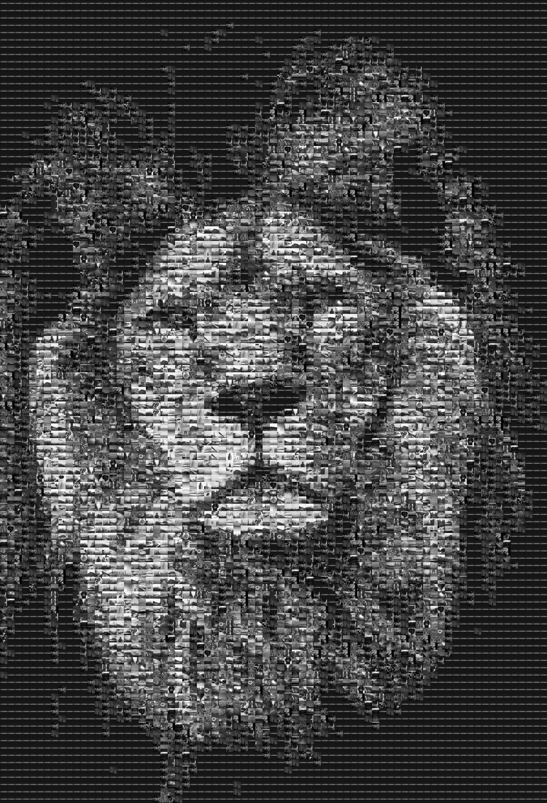

# Mosaic

A Python tool to create mosaic photos (image made up of tiny images).


# Usage

```python
import os
import mosaic

tiles_dir = 'tiles'
mosaic.make_mosaic(
    'image.jpeg',
    [os.path.join(tiles_dir, file) for file in os.listdir(tiles_dir)],
    tile_size=50, # tiles will be resized to 50x50; image height/width need to be divisible by 50
    output='mosaic.jpeg'
)
```

To make a grayscale mosaic, you can use `import gray_mosaic; gray_mosaic.make_mosaic(...)` that's much faster.

# Get some tiles

Use the `download.py` script.

# Example

